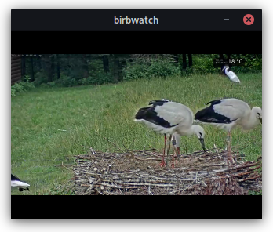

# birbwatch

A projet to make a mini-TV to display livecams of birds !

 

TODO
- add laser printed parts
- add pictures of finished project

## Stream sources

Stream sources are contained in a `.json` file. 

```json
// streams.json
{
	"streamlist": [
		{
			"name": "youtube example",
			"description": "a youtube stream example",
			"url": "https://youtu.be/MMbTUvSjnB4"
		},
		{
			"name": "m3u8 example",
			"description": "a m3u8 stream example",
			"url": "https://live.hdontap.com/hls/hosb3/fobwr_eagles-ptz.stream/playlist.m3u8"
		},
		{
			"name": "invalid example",
			"description": "i will cause problems on purpose",
			"url": "https://thisstreamdoesnotexistpleasedonotthankyou.com"
		}
	]
}
```

The backend accepts multiple sources as a fallback in `config.ini`. Use `https://` to specify an online location, or `file://` to point to a local file.

```ini
; config.ini
# source for the stream database .json file, in order of priority (newline separated list)
stream_db_source =
	https://raw.githubusercontent.com/ninivert/birbwatch/main/streams.json
	file://./streams.json
```

## Frontend GUI (Python)

Install (preferably in a clean environment) with `pip install -e .`.
Then launch the GUI with `python -m birbwatch`

Instructions :
- Refresh the stream sources. See `config.ini` to specify the `.json` file containing the sources.
- Select the stream to launch
- Tap the screen in the media player to return to the settings screen.

## Backend and `config.ini`

The backend launches [`streamlink`](https://streamlink.github.io/) in a background process. Streamlink creates a local streaming server at the port specified in `streamserver.port`. The quality is chosen to be `360p` (native screen resolution on our hardware), and other fallback qualities can be specified in the `streamlink` section. The streamlink process is watched, and a QMediaPlayer instance connects to the local streaming server once the stream is ready.

## Hardware and parts

- Raspberry Pi Zero W 1.1
- RPi Touch Screen 3.2” / 2.2” SPI Not Touch
- Buttons for inputs (D-PAD style, or 6 little button)